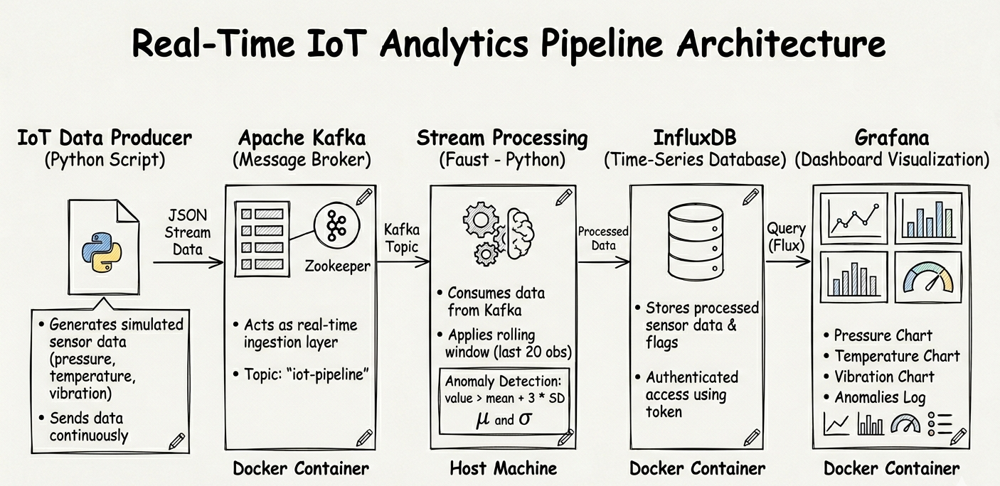
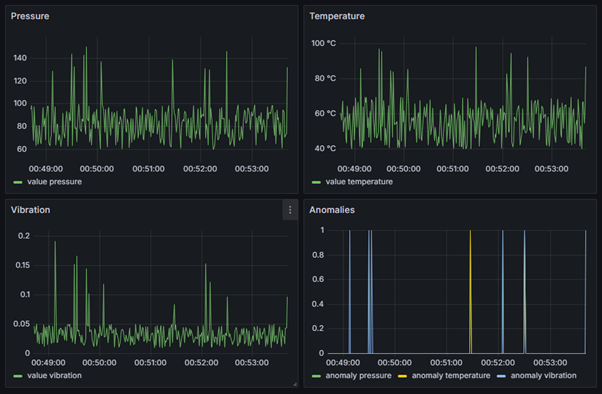

---

# Real-Time IoT Data Analytics Pipeline

This project implements a real-time IoT data analytics pipeline for industrial monitoring. It simulates sensor data (pressure, temperature, vibration), processes it using a streaming architecture, detects anomalies, and visualises results using dashboards.

The system demonstrates how real-time data pipelines can be built using Apache Kafka, Faust, InfluxDB, and Grafana.

---

##  System Architecture



Pipeline flow:

Producer → Kafka → Faust → InfluxDB → Grafana

- **Producer**: Generates simulated IoT sensor data  
- **Kafka**: Handles real-time data ingestion  
- **Faust**: Processes streaming data and performs analytics  
- **InfluxDB**: Stores time-series data  
- **Grafana**: Visualises data in real time  

---

##  Technologies Used

- Python  
- Apache Kafka  
- Faust  
- InfluxDB  
- Grafana  
- Docker  

---

##  Features

- Real-time data streaming  
- Rolling window analytics (last 20 observations)  
- Statistical aggregation (mean and standard deviation)  
- Z-score based anomaly detection  
- Live dashboard visualisation  

---

##  Project Structure

```

.
├── producer/
│   └── producer.py
├── faust_app/
│   └── stream_processor.py
├── docker/
│   ├── docker-compose.yml
│   └── grafana/
│       ├── dashboards/
│       │   └── iot_dashboard.json
│       └── provisioning/
│           ├── dashboards/
│           └── datasources/
├── docs/
│   ├── architecture-diagram.png
│   ├── dashboard-sensor.png
│   
├── .env.example
├── requirements.txt
└── README.md

````

---

## Setup & Installation

### 1. Clone the repository

```bash
git clone https://github.com/Johnifec/iot-real-time-analytics-pipeline.git
cd iot-real-time-analytics
````

---

### 2. Create environment file

```bash
cp .env.example .env
```

---

### 3. Start infrastructure (Docker)

 From the **project root directory**:

```bash
cd docker
docker-compose up -d
```

This will start:

* Kafka
* Zookeeper
* InfluxDB
* Grafana

---

### 4. Install Python dependencies

 Open a **new terminal** and return to the root directory:

```bash
cd ..
pip install -r requirements.txt
```

---

### 5. Start Faust stream processor

 In the **same terminal (root directory)**:

```bash
faust -A faust_app.stream_processor worker -l info --web-port 6067
```

You should see:

```
Worker ready
```

---

### 6. Run the data producer

 Open **another new terminal** (important)

From the **root directory**:

```bash
python producer/producer.py
```

You should see:

```
Sent: {...}
```

---

##  Viewing the Dashboard

Open Grafana:

```
http://localhost:3000
```

Login:

* Username: admin
* Password: admin

---

###  Load the Dashboard

1. Click **Dashboards**
2. Select:

```
IoT Real-Time Monitoring
```

---

###  Expected Output



You should see:

* Pressure chart
* Temperature chart
* Vibration chart
* Anomaly detection chart

Charts will start updating **within a few seconds** once the producer and stream processor are running.


---

##  Analytics Approach

The system uses stream processing with a rolling window:

* Maintains the last **20 observations**
* Computes:

  * Mean
  * Standard deviation

### Anomaly Detection Rule

```
value > mean + 3 × standard deviation
```

Applied to:

* pressure
* temperature
* vibration

---

##  Notes

* The system runs locally using Docker containers
* Data is stored in InfluxDB and may grow over time
* Running all services may consume significant CPU and memory

To stop the system:

```bash
docker-compose down
```

---

##  Future Improvements

* Use real-world IoT datasets
* Implement machine learning-based anomaly detection
* Deploy to cloud environment
* Add alerting mechanisms


##  License

This project is licensed under the MIT License.


